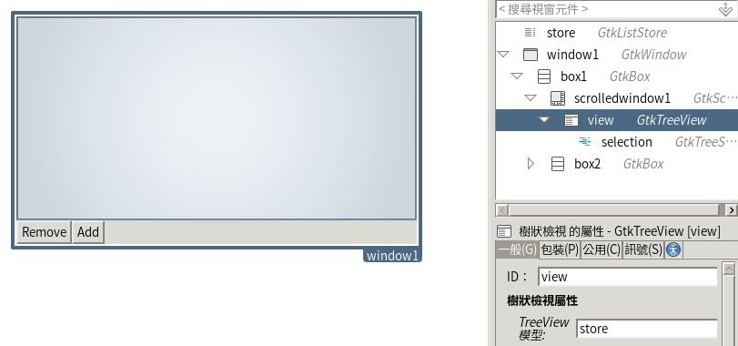

# 数据对象#

> 当我们谈及数据，不只在说数据库，也包括其他来源的数据。这个过程包括访问和操纵这些数据，并把它们展现给用户。便捷地访问数据意味着更好地集成，而 GNOME 擅长此方面。GNOME 提供了许多用于完成这些工作的 API ；我们将在本章讨论它们。

本章将讲述如何从多个数据源获取数据并展现在屏幕上，使用 GTK+ 的`TreeView`控件在屏幕上显示数据。本章也将介绍`Evolution`数据服务器库，以从通讯录中收集数据。为简便起见，本章只使用 Seed 和 Glade 。
在本章中，将更详细地研究以下主题：
 * 用`TreeView`展示数据
 * Evolution 数据服务器结构
 * 访问 Evolution 数据服务器的通讯录
现在，让我们抓取数据！

## 用`TreeView`展示数据

GTK+ `TreeView`是一种既可以展示树形数据，也可以展示列表类型数据的控件。此控件通过 **模型、视图、控制器（MVC）** 设计模式，从逻辑上区分了数据模型的实现、数据的展示和数据的访问及处理。

上图直观地展示了设计模式。要理解这幅图，可以想象这是一个网络搜索引擎。用户，不管是最终用户还是一些代码，触发了控制器。更具体一点，这一步可以是用户按下**搜索**按钮，或者一段代码向 Web 提交了一个搜索请求，也可能是任何东西直接出发控制器去做一些事情。随后，控制器按照需求修改模型。在这个搜索引擎案例中，服务器上的搜索引擎会提取请求，将其组织成参数，并作为输入传递给模型。模型将产生新的数据，代入到视图中。视图则把数据展现给用户；具体来说，就是屏幕上显示的搜索结果。

用这种方法，我们可以有各种不同的展示形式而不改变模型和控制器的实现。在网页浏览器中，搜索引擎可以显示详细结果；但在智能手机上，则只能显示简单形式的结果。

在GTK+中，`TreeModel`接口定义了模型，而模型需要被提供者实现。不过，GTK+ 提供了两个可以直接使用的简单模型，所以我们可以不用自己实现`TreeModel`接口。这两个接口分别是`ListStore`和`TreeStore`。`ListStore`用于简单的列表数据结构，而`TreeStore`用于树形数据结构。我们要在模型中定义要保留的数据。

要访问模型，我们需要用`Iter`对象遍历模型。`Iter`对象指向数据模型中一个具体的记录。我们可以在数据模型中移动这个对象的指向。

## 实践环节——使用`TreeView` ##

假设我们想建立一个简单的应用程序，在表格中列出数据，并对其删除和新增数据。这些可以按以下步骤完成：

1. 建立一个新的 Glade UI 文件，命名为`treeview.ui`。
2. 加入一个窗口。
3. 在窗口中加入一个`Box`控件，其中有两个元素。设置为竖排。
4. 加入一个`ScrollableWindow`窗口到 UI 的上部，并设置为可扩展。
5. 在下部加入另一个能容纳两个元素的`Box`，设置为横排。
6. 在横排盒子中加入两个按钮，命名为`btnRemove`和`btnAdd`，并分别设置标签为 **Remove**和**Add**。
7. 在`ScrollableWindow`窗口中加入一个`TreeView`控件。位于**Control and Display**（控制与显示）.
8. 此时将会弹出一个对话框，询问要选择的模型；按下省略号按钮，并点击`新建`。
9. 模型对话框将自动填充为`liststore1`。
10. 点击`创建`按钮。
11. 在控件列表中选择**liststore1**。
12. 在**常规**选项卡把选中的liststore重命名为`store`。
13. 在**添加和删除栏**处，单击**<定义一个新的栏>**；它将被转换为一个`gchararray`类型的文字条目。
14. 重复第13步。此时将有两个`gchararray`类型的条目。
15. 把`treeview1`对象重命名为`view`。
16. 在`view`下找到`treeselection1`对象，重命名为`selection`。
17. 此时的glade文件应该类似以下截图：  
  
18. 新建一个 Seed 脚本文件，名为 `treeview.js`。
19. 加入以下代码：
        
        #!/usr/bin/env seed
        
        Gtk = imports.gi.Gtk;
        GObject = imports.gi.GObject;
        Main = new GType({
          parent: GObject.Object.type,
          name: "Main",
          init: function (self) {
            var columns = {
              NAME: 0,
              ADDRESS: 1,
            }
            var ui = new Gtk.Builder()
            this.ui = ui;
            ui.add_from_file("treeview.ui");
            var window = ui.get_object("window1");
            window.resize(300, 400);
            window.show_all();
            window.signal.destroy.connect(Gtk.main_quit);
            this.clients = {};
            var view = ui.get_object("view");
            var selection = ui.get_object("selection");
            selection.signal.changed.connect(function (s) {
              var btnRemove = ui.get_object("btnRemove");
              btnRemove.sensitive = true;
            });
            var btnRemove = ui.get_object("btnRemove");
            btnRemove.signal.clicked.connect(function () {
              var selection = view.get_selection();
              if (selection) {
                var selected = {};
                var valid = selection.get_selected(selected);
                if (valid && selected.iter) {
                  var model = view.get_model();
                  model.remove(selected.iter);
                }
              }
            });
            var btnAdd = ui.get_object("btnAdd");
            btnAdd.signal.clicked.connect(function () {
              var selection = view.get_selection();
              if (selection) {
                var selected = {};
                var valid = selection.get_selected(selected);
                if (valid && selected.iter) {
                  var model = view.get_model();
                  model.insert(selected.iter, 1);
                }
              }
            });
            column = new Gtk.TreeViewColumn({
              title: 'Name'
            });
            cell = new Gtk.CellRendererText();
            cell.editable = true;
            column.pack_start(cell);
            column.add_attribute(cell, 'text', columns.NAME);
            cell.signal.edited.connect(function (obj, path, text) {
              var store = view.get_model();
              var path = new Gtk.TreePath.from_string(path);
              var iter = {};
              store.get_iter(iter, path);
              store.set_value(iter.iter, columns.NAME, text);
            });
            view.append_column(column);
            column = new Gtk.TreeViewColumn({
              title: 'Address'
            });
            cell = new Gtk.CellRendererText();
            cell.editable = true;
            column.pack_start(cell);
            column.add_attribute(cell, 'text', columns.ADDRESS);
            cell.signal.edited.connect(function (obj, path, text) {
              var store = view.get_model();
              var path = new Gtk.TreePath.from_string(path);
              var iter = {};
              store.get_iter(iter, path);
              store.set_value(iter.iter, columns.ADDRESS, text);
            });
            view.append_column(column);
            var store = view.get_model();
            var iter = {};
            store.append(iter);
            store.set_value(iter.iter, columns.NAME, "Robert");
            store.set_value(iter.iter, columns.ADDRESS, "North Pole");
          }
        });
        Gtk.init(Seed.argv);
        var main = new Main();
        Gtk.main();
20. 运行应用。点击字段可以编辑数据；如果要在某行后再添加一行，选中并点击**Add**；删除选中的列同理。图示如下：  
  ![图8-3 范例应用][8-3] 

  [8-3]: ./img/8-3.png width=100px

#### 刚刚发生了什么？

这个例子描述了`TreeView`工作的方式。`TreeView`和两个`CellRendererText`控件及相应的`TreeView`栏位作为视图部分。`ListStore`则对应模型部分。

首先定义想要维护的的数据。数据被组织为两个栏位，每个的类型都是字符串。栏位用数字的常量来引用，`NAME`指向栏位`0`，`ADDRESS`指向栏位1。如下所示：

    var columns = {
        NAME: 0,
        ADDRESS:1,
    }

用view变量存放`TreeView`的引用，以便快速访问：

    var view = ui.get_object("view");

订阅选中项`selection`被改变的信号`changed`。每选中一个行，程序就会调用这段代码。目前它还不做任何有意义的事情。而在实际项目中，就可能做诸如启用一些按钮、显示提示的事情。以下是`selection`的代码：

    var selection = ui.get_object("selection");
    selection.signal.changed.connect(function(s) {
      var btnRemove = ui.get_object("btnRemove");
      btnRemove.sensitive = true;
    });

连接`Remove`按钮的点击信号`clicked`，使之删除一行记录。代码如下：

    var btnRemove = ui.get_object("btnRemove");
    btnRemove.signal.clicked.connect(function() {

首先，执行如下代码，取得当前选中项`selection`：

    var selection = view.get_selection();
    if (selection) {
      var selected = {};
      var valid = selection.get_selected(selected);

若`selection`对象有效，则取得选中的`row`对象。如果记录存在，取得选中对象中的`iter`对象。

取得`iter`对象后，我们可以用如下代码删除此行记录：

    var model = view.get_model();
    model.remove(selected.iter);

之后对`Add`按钮做相同动作。只是插入一个新记录而不是删除记录：

    var btnAdd = ui.get_object("btnAdd");
    btnAdd.signal.clicked.connect(function() {
      var selection = view.get_selection();
      if (selection) {
        var selected = {};
        var valid = selection.get_selected(selected);
        if (valid && selected.iter) {
          var model = view.get_model();
          model.insert(selected.iter, 1);
        }
      }
    });

然后设置栏位。每个栏位都用`TreeViewColumn`控件表示，每个`TreeViewColumn`都连接到一个`CellRenderer`类。因为我们的数据是纯文本，所以使用`CellRendererText`。

    column = new Gtk.TreeViewColumn({title:'Name'});
    cell = new Gtk.CellRendererText();

然后，设置单元格可编辑，以便加入到栏位中之后可以修改数据：

    cell.editable = true;
    column.pack_start(cell);

用`add_attribute`方法把我们的`ListStore`模型和栏位、单元格以及数据相关联。修改`cell`对象的`text`属性，使之从第0个栏位（`columns.NAME`）取得数据。

    column.add_attribute(cell, 'text', columns.NAME);
    view.append_column(column);

还记得我们在Anjuta中，在liststore1控件中创建两个栏位，使其容纳两个`gchararray`元素吗？这表明两个栏位都是`gchararray`类型的，也就是字符串类型。首栏用于存放`column.NAME`的值，而第二栏用于存放的则是`column.ADDRESS`的值。

随后连接修改信号`edited`到单元格`cell`上。这段处理函数所做的就是简单取得新编辑的文字，并存入模型。

    cell.signal.edited.connect(function(obj, path, text) {
      var store = view.get_model();

首先根据`path`参数取得实际的`path`对象，得到的对象可以被`ListStore`读取。

    var path = new Gtk.TreePath.from_string(path);
    var iter = {};

为了设定数据，需要当前被编辑对象的`iter`对象。我们使用`path`变量，将其转换`iter`对象。之后，用`set_value`方法设置模型。此时也要在`set_value`方法的参数中指明我们想要编辑的栏。

    store.get_iter(iter, path);
    store.set_value(iter.iter, columns.NAME, text);

加入地址栏，代码同名称栏。

现在加入一行初始数据。首先，取得模型。

    var store = view.get_model();

将`iter`对象追加到模型中。
    
    var iter = {};
    store.append(iter);

之后，用`iter`对象设置值。

    store.set_value(iter.iter, columns.NAME, "Robert"); 
    store.set_value(iter.iter, columns.ADDRESS, "North Pole");

取得并操纵数据的进程很直观。先取得模型和`Iter`对象，然后从中取得新的值或者加入新的值到模型中，只需指明想要处理的栏。

接下来，我们将用 Evolution 数据服务器中的实际数据取代虚构数据。
