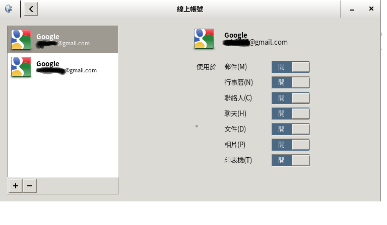
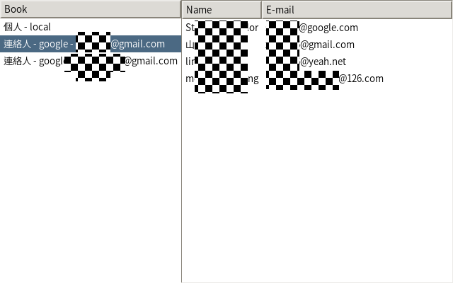

# 数据对象#

> 当我们谈及数据，不只在说数据库，也包括其他来源的数据。这个过程包括访问和操纵这些数据，并把它们展现给用户。便捷地访问数据意味着更好地集成，而 GNOME 擅长此方面。GNOME 提供了许多用于完成这些工作的 API ；我们将在本章讨论它们。

本章将讲述如何从多个数据源获取数据并展现在屏幕上，使用 GTK+ 的`TreeView`控件在屏幕上显示数据。本章也将介绍`Evolution`数据服务器库，以从地址簿中收集数据。为简便起见，本章只使用 Seed 和 Glade 。
在本章中，将更详细地研究以下主题：

* 用`TreeView`展示数据

* Evolution 数据服务器结构

* 访问 Evolution 数据服务器的地址簿

现在，让我们抓取数据！

## 用`TreeView`展示数据

GTK+ `TreeView`是一种既可以展示树形数据，也可以展示列表类型数据的控件。此控件通过 **模型、视图、控制器（MVC）** 设计模式，从逻辑上区分了数据模型的实现、数据的展示和数据的访问及处理。


上图直观地展示了设计模式。要理解这幅图，可以想象这是一个网络搜索引擎。用户，不管是最终用户还是一些代码，触发了控制器。更具体一点，这一步可以是用户按下**搜索**按钮，或者一段代码向 Web 提交了一个搜索请求，也可能是任何东西直接出发控制器去做一些事情。随后，控制器按照需求修改模型。在这个搜索引擎案例中，服务器上的搜索引擎会提取请求，将其组织成参数，并作为输入传递给模型。模型将产生新的数据，代入到视图中。视图则把数据展现给用户；具体来说，就是屏幕上显示的搜索结果。

用这种方法，我们可以有各种不同的展示形式而不改变模型和控制器的实现。在网页浏览器中，搜索引擎可以显示详细结果；但在智能手机上，则只能显示简单形式的结果。

在GTK+中，`TreeModel`接口定义了模型，而模型需要被提供者实现。不过，GTK+ 提供了两个可以直接使用的简单模型，所以我们可以不用自己实现`TreeModel`接口。这两个接口分别是`ListStore`和`TreeStore`。`ListStore`用于简单的列表数据结构，而`TreeStore`用于树形数据结构。我们要在模型中定义要保留的数据。

要访问模型，我们需要用`Iter`对象遍历模型。`Iter`对象指向数据模型中一个具体的记录。我们可以在数据模型中移动这个对象的指向。


## 实践环节——使用`TreeView` ##

假设我们想建立一个简单的应用程序，在表格中列出数据，并对其删除和新增数据。这些可以按以下步骤完成：

1. 建立一个新的 Glade UI 文件，命名为`treeview.ui`。
2. 加入一个窗口。
3. 在窗口中加入一个`Box`控件，其中有两个元素。设置为竖排。
4. 加入一个`ScrollableWindow`窗口到 UI 的上部，并设置为可扩展。
5. 在下部加入另一个能容纳两个元素的`Box`，设置为横排。
6. 在横排盒子中加入两个按钮，命名为`btnRemove`和`btnAdd`，并分别设置标签为 **Remove**和**Add**。
7. 在`ScrollableWindow`窗口中加入一个`TreeView`控件。位于**Control and Display**（控制与显示）.
8. 此时将会弹出一个对话框，询问要选择的模型；按下省略号按钮，并点击`新建`。
9. 模型对话框将自动填充为`liststore1`。
10. 点击`创建`按钮。
11. 在控件列表中选择**liststore1**。
12. 在**常规**选项卡把选中的liststore重命名为`store`。
13. 在**添加和删除栏**处，单击**<定义一个新的栏>**；它将被转换为一个`gchararray`类型的文字条目。
14. 重复第13步。此时将有两个`gchararray`类型的条目。
15. 把`treeview1`对象重命名为`view`。
16. 在`view`下找到`treeselection1`对象，重命名为`selection`。
17. 此时的glade文件应该类似以下截图：  
  
18. 新建一个 Seed 脚本文件，名为 `treeview.js`。
19. 加入以下代码：
        
    ````JavaScript
    #!/usr/bin/env seed
    
    Gtk = imports.gi.Gtk;
    GObject = imports.gi.GObject;
    Main = new GType({
      parent: GObject.Object.type,
      name: "Main",
      init: function (self) {
        var columns = {
          NAME: 0,
          ADDRESS: 1,
        }
        var ui = new Gtk.Builder()
        this.ui = ui;
        ui.add_from_file("treeview.ui");
        var window = ui.get_object("window1");
        window.resize(300, 400);
        window.show_all();
        window.signal.destroy.connect(Gtk.main_quit);
        this.clients = {};
        var view = ui.get_object("view");
        var selection = ui.get_object("selection");
        selection.signal.changed.connect(function (s) {
          var btnRemove = ui.get_object("btnRemove");
          btnRemove.sensitive = true;
        });
        var btnRemove = ui.get_object("btnRemove");
        btnRemove.signal.clicked.connect(function () {
          var selection = view.get_selection();
          if (selection) {
            var selected = {};
            var valid = selection.get_selected(selected);
            if (valid && selected.iter) {
              var model = view.get_model();
              model.remove(selected.iter);
            }
          }
        });
        var btnAdd = ui.get_object("btnAdd");
        btnAdd.signal.clicked.connect(function () {
          var selection = view.get_selection();
          if (selection) {
            var selected = {};
            var valid = selection.get_selected(selected);
            if (valid && selected.iter) {
              var model = view.get_model();
              model.insert(selected.iter, 1);
            }
          }
        });
        column = new Gtk.TreeViewColumn({
          title: 'Name'
        });
        cell = new Gtk.CellRendererText();
        cell.editable = true;
        column.pack_start(cell);
        column.add_attribute(cell, 'text', columns.NAME);
        cell.signal.edited.connect(function (obj, path, text) {
          var store = view.get_model();
          var path = new Gtk.TreePath.from_string(path);
          var iter = {};
          store.get_iter(iter, path);
          store.set_value(iter.iter, columns.NAME, text);
        });
        view.append_column(column);
        column = new Gtk.TreeViewColumn({
          title: 'Address'
        });
        cell = new Gtk.CellRendererText();
        cell.editable = true;
        column.pack_start(cell);
        column.add_attribute(cell, 'text', columns.ADDRESS);
        cell.signal.edited.connect(function (obj, path, text) {
          var store = view.get_model();
          var path = new Gtk.TreePath.from_string(path);
          var iter = {};
          store.get_iter(iter, path);
          store.set_value(iter.iter, columns.ADDRESS, text);
        });
        view.append_column(column);
        var store = view.get_model();
        var iter = {};
        store.append(iter);
        store.set_value(iter.iter, columns.NAME, "Robert");
        store.set_value(iter.iter, columns.ADDRESS, "North Pole");
      }
    });
    Gtk.init(Seed.argv);
    var main = new Main();
    Gtk.main();
    ````
      
20. 运行应用。点击字段可以编辑数据；如果要在某行后再添加一行，选中并点击**Add**；删除选中的列同理。图示如下：  
  ![图8-3 范例应用][8-3] 

  [8-3]: ./img/8-3.png width=200px

#### 刚刚发生了什么？

这个例子描述了`TreeView`工作的方式。`TreeView`和两个`CellRendererText`控件及相应的`TreeView`栏位作为视图部分。`ListStore`则对应模型部分。

首先定义想要维护的的数据。数据被组织为两个栏位，每个的类型都是字符串。栏位用数字的常量来引用，`NAME`指向栏位`0`，`ADDRESS`指向栏位1。如下所示：

    var columns = {
        NAME: 0,
        ADDRESS:1,
    }

用view变量存放`TreeView`的引用，以便快速访问：

    var view = ui.get_object("view");

订阅选中项`selection`被改变的信号`changed`。每选中一个行，程序就会调用这段代码。目前它还不做任何有意义的事情。而在实际项目中，就可能做诸如启用一些按钮、显示提示的事情。以下是`selection`的代码：

    var selection = ui.get_object("selection");
    selection.signal.changed.connect(function(s) {
      var btnRemove = ui.get_object("btnRemove");
      btnRemove.sensitive = true;
    });

连接`Remove`按钮的点击信号`clicked`，使之删除一行记录。代码如下：

    var btnRemove = ui.get_object("btnRemove");
    btnRemove.signal.clicked.connect(function() {

首先，执行如下代码，取得当前选中项`selection`：

    var selection = view.get_selection();
    if (selection) {
      var selected = {};
      var valid = selection.get_selected(selected);

若`selection`对象有效，则取得选中的`row`对象。如果记录存在，取得选中对象中的`iter`对象。

取得`iter`对象后，我们可以用如下代码删除此行记录：

    var model = view.get_model();
    model.remove(selected.iter);

之后对`Add`按钮做相同动作。只是插入一个新记录而不是删除记录：

    var btnAdd = ui.get_object("btnAdd");
    btnAdd.signal.clicked.connect(function() {
      var selection = view.get_selection();
      if (selection) {
        var selected = {};
        var valid = selection.get_selected(selected);
        if (valid && selected.iter) {
          var model = view.get_model();
          model.insert(selected.iter, 1);
        }
      }
    });

然后设置栏位。每个栏位都用`TreeViewColumn`控件表示，每个`TreeViewColumn`都连接到一个`CellRenderer`类。因为我们的数据是纯文本，所以使用`CellRendererText`。

    column = new Gtk.TreeViewColumn({title:'Name'});
    cell = new Gtk.CellRendererText();

然后，设置单元格可编辑，以便加入到栏位中之后可以修改数据：

    cell.editable = true;
    column.pack_start(cell);

用`add_attribute`方法把我们的`ListStore`模型和栏位、单元格以及数据相关联。修改`cell`对象的`text`属性，使之从第0个栏位（`columns.NAME`）取得数据。

    column.add_attribute(cell, 'text', columns.NAME);
    view.append_column(column);

还记得我们在Anjuta中，在liststore1控件中创建两个栏位，使其容纳两个`gchararray`元素吗？这表明两个栏位都是`gchararray`类型的，也就是字符串类型。首栏用于存放`column.NAME`的值，而第二栏用于存放的则是`column.ADDRESS`的值。

随后连接修改信号`edited`到单元格`cell`上。这段处理函数所做的就是简单取得新编辑的文字，并存入模型。

    cell.signal.edited.connect(function(obj, path, text) {
      var store = view.get_model();

首先根据`path`参数取得实际的`path`对象，得到的对象可以被`ListStore`读取。

    var path = new Gtk.TreePath.from_string(path);
    var iter = {};

为了设定数据，需要当前被编辑对象的`iter`对象。我们使用`path`变量，将其转换`iter`对象。之后，用`set_value`方法设置模型。此时也要在`set_value`方法的参数中指明我们想要编辑的栏。

    store.get_iter(iter, path);
    store.set_value(iter.iter, columns.NAME, text);

加入地址栏，代码同名称栏。

现在加入一行初始数据。首先，取得模型。

    var store = view.get_model();

将`iter`对象追加到模型中。
    
    var iter = {};
    store.append(iter);

之后，用`iter`对象设置值。

    store.set_value(iter.iter, columns.NAME, "Robert"); 
    store.set_value(iter.iter, columns.ADDRESS, "North Pole");

取得并操纵数据的进程很直观。先取得模型和`Iter`对象，然后从中取得新的值或者加入新的值到模型中，只需指明想要处理的栏。

接下来，我们将用 Evolution 数据服务器中的实际数据取代虚构数据。

## Evolution 数据服务器（EDS）架构

EDS抽象出对地址簿、日历和任务的访问和操作。
其插件架构使开发人员能够编写插件来访问一个特定的地址簿、日历、或任务的服务。
EDS用户使用抽象的API，而不需要了解所涉及服务的详细信息。
用这种方法，GNOME理论上支持任何种类的地址簿、日历或任务的服务。下图简要说明了EDS架构的结构：


EDS提供了一个保持在内存中的守护进程，以服务EDS用户——通常是
电子邮件客户端，即时消息应用程序，或任何需要访问数据的应用程序。如果
该服务需要认证或授权，GNOME会弹出一个对话框，以便最终
用户可以与其交互，例如填写密码，授予访问权限等等。

在EDS中，地址簿有个数据源组的概念，用于表示数据的来源，比如本地或远程数据源，逻辑上用`EBook.SourceGroup`对象来表示。每个`SourceGroup`组可以有很多实际数据来源，每个都由EBook.Source对象描述。

## 实践环节——设置地址簿和日历数据源

访问地址簿和日历的数据之前，需要先设置数据源。下面将讨论如何在 GNOME 中设置 Google 帐户。继续之前，请先确定你已经有一个 Google 帐户。设置方法如下：

1. 打开 **GNOME系统设置** 。
2. 打开 **在线帐户**。
3. 点击窗口左下角的**+**按钮。
4. 选择希望用在 GNOME 中的帐户。在这个实例中，选择 **Google services**。
5. 此时将显示服务的登录页面。
6. 确认成功登录到服务中。
7. 授权给 GNOME。
8. 完成所有在线操作后，启用要在 GNOME 中使用的服务，尤其是**通讯录**服务，如下图所示。




#### 刚刚发生了什么？

我们刚刚连接到了我们的 Google 帐户。这意味着我们可以使用 GNOME 的 API 访问 Google 帐户保存的数据。这也是我们接下来要做的。

## 实践环节——访问地址簿

假设我们要创建一个简单的地址簿程序。这些数据可能来自
本地计算机中的地址簿或来自远程的 Google 。请按照下列步骤操作：

1. 新建Glade `.ui` 文件，命名为`address-book.ui`。
2. 添加含有两个项目的水平框。
3. 在框的左侧放一个`TreeView`控件。重命名为`bookView`。提示选择模型时，创建一个新的`ListStore`模型并重命名为`books`。
4. 将`TreeView`控件自动生成的`TreeSelection`对象重命名为`selection`。
5. 在框的右侧放一个`ScrollableWindow`窗口。
6. 然后，把另一个`TreeView`控件放在`ScrollableWindow`内。为其创建一个新的`ListStore`并重命名为`contacts`。重命名这个`TreeView`为`contactView`。
7. 编辑名为`books`的`ListStore`模型。添加两列到该模型中，类型均为`gchararray`。
8. 编辑名为`contacts`的`ListStore`模型。同样添加两列到该模型中，类型均为`gchararray`。
9. 此时的UI设计应该类似以下截图：  

10. 新建 Seed 脚本，命名为`address-book.js`。
11. 以下代码对脚本的执行起着非常重要的作用。
    
    ````JavaScript
    Main = new GType({
      parent: GObject.Object.type,
      name: "Main",
      init: function (self) {
        var bookColumn = {
          UID: 0,
          NAME: 1,
        }
        var contactColumn = {
          NAME: 0,
          EMAIL: 1,
        }
        this.listContacts = function (e) {
          var c = {};
          var q = EBook.BookQuery.any_field_contains("");
          var r = e.get_contacts_sync(q.to_string(), c, null);
          if (r && c && c.contacts && c.contacts.length > 0) {
            var store = self.contact_view.get_model();
            c.contacts.forEach(function (contact) {
              var iter = {};
              store.append(iter);
              var name = contact.full_name;
              if (!name) {
                name = contact.nickname;
              }
              store.set_value(iter.iter, contactColumn.NAME,
                name);
              store.set_value(iter.iter, contactColumn.EMAIL,
                contact.email_1);
            });
          }
        }
        this.clients = {};
        var book_view = ui.get_object("bookView");
        var selection = ui.get_object("selection");
        selection.signal.changed.connect(function (s) {
          var selected = {}
          s.get_selected(selected);
          var book = selected.model.get_value(selected.iter,
            bookColumn.UID);
          var uid = book.value.get_string();
          if (uid == "") {
            return;
          }
          source = self.sources.peek_source_by_uid(uid);
          var e = null;
          if (typeof (self.clients[uid]) !== "undefined") {
            e = self.clients[uid];
            if (e) {
              self.clients[uid] = e;
              self.listContacts(e);
            }
          } else {
            var e = new EBook.BookClient.c_new(source);
            var r = e.open(false, null, function () {
              if (e) {
                self.clients[uid] = e;
                self.listContacts(e);
              }
            });
          }
        });
        var cell = new Gtk.CellRendererText();
        var column = new Gtk.TreeViewColumn({
          title: 'Book'
        });
        column.pack_start(cell);
        column.add_attribute(cell, 'markup', bookColumn.NAME);
        book_view.append_column(column);
        var contact_view = ui.get_object("contactView");
        this.contact_view = contact_view;
        cell = new Gtk.CellRendererText();
        column = new Gtk.TreeViewColumn({
          title: 'Name'
        });
        column.pack_start(cell);
        column.add_attribute(cell, 'text', contactColumn.NAME);
        contact_view.append_column(column);
        cell = new Gtk.CellRendererText();
        column = new Gtk.TreeViewColumn({
          title: 'E-mail'
        });
        column.pack_start(cell);
        column.add_attribute(cell, 'text', contactColumn.EMAIL);
        contact_view.append_column(column);
        var s = {};
        var e = EBook.BookClient.get_sources(s);
        this.sources = s.sources;
        var groups = this.sources.peek_groups();
        if (groups && groups.length > 0) {
          var store = book_view.get_model();
          groups.forEach(function (item) {
            var iter = {};
            store.append(iter);
            store.set_value(iter.iter, bookColumn.UID, "");
            store.set_value(iter.iter, bookColumn.NAME,
              "<b><i>" + item.peek_name() +
              "</i></b>");
            var sources = item.peek_sources();
            if (sources && sources.length > 0) {
              sources.forEach(function (source) {
                store.append(iter);
                store.set_value(iter.iter, bookColumn.UID,
                  source.peek_uid());
                store.set_value(iter.iter, bookColumn.NAME,
                  source.peek_name());
              });
            }
          });
        }
      }
    });
    ````
      
12. 运行代码。应用程序将被执行并显示一个窗口，如以下截图：  


#### 刚刚发生了什么？

根据您的设置，以上练习的结果可能看起来不一样（也请原谅我出于隐私原因模糊了文字，因为这些都是真正的e-mail地址）。在前面的截图中，EDS返回四个地址簿数据源，分别是**此计算机上**，**LDAP服务器**，**WebDAV**和**Google**。在这些资源中，只有**此计算机上**和**Google**两个含有真实的数据。在前面的截图中列出了地址簿**Personal**和**Contacts**。

点击**Contacts**时，所有联系人都显示在右侧的窗口中。这里我们只显示两个栏位，姓名和 e-mail 地址。

让我们深入到源代码中。

首先我们为每一列定义常数。在这里，我们有两个模型，分别是地址簿集合（我们称之为`books`）和联系人集合（`contacts`）。每个地址簿都有唯一的标识符和名称。因此，我们定义以下几栏。
    
    var bookColumn = {
        UID: 0,
        NAME: 1,
    }

对于联系人，我们只显示姓名和 e-mail 地址，所以也只需要两栏。
    
    var contactColumn = {
        NAME: 0,
        EMAIL: 1,
    }

用`book_view`变量存放`.ui`文件中`bookView`对象的引用：
    
    var book_view = ui.get_object("bookView");
    
获取`bookView`的`selection`对象，存入`selection`变量。
    
    var selection = ui.get_object("selection");
    
我们希望选取时的行为应该是，选中一个地址簿后就得到地址簿的内容。为了做到这一点，我们需要修改选中信号连接到的函数，正如以下所示：
    
    selection.signal.changed.connect(function(s) {

在回调函数中，首先要从`selection`对象取得选中项。
    
    var selected = {}
    s.get_selected(selected);

我们从`selected`对象中获取`Iter`对象，保存在`iter`成员变量中。立即取得第0栏（`bookColumn.UID`）的值。值的类型是字符串，所以用`get_string()`函数。我们要设置一个特殊行为：每当UID值是空的，这意味着该行不指向特定的地址簿。这被程序用作显示地址簿的数据源。

    var book = selected.model.get_value(selected.iter, bookColumn.UID);
    var uid = book.value.get_string();
    if (uid == "") {
        return;
    }

若`uid`含有值，将询问 EDS 以直接取得`EBook.Source`，其中使用`uid`作标识。
这将返回一个`EBook.Source`对象并存放在变量`e`中。

将取得的数据源保存在客户端的缓存中，故无需每次点击时重新打开数据源。
当缓存内定义有`uid`对应的数据源时，只需调用`listContacts`方法；
否则，需要先连接到数据源。之后，将数据源存入缓存。
然后我们使用listContacts列出内容，如以下代码所示：
      
      source = self.sources.peek_source_by_uid(uid);
      var e = null;
      if (typeof(self.clients[uid]) !== "undefined") {
        e = self.clients[uid];
        if (e) {
          self.clients[uid] = e;
          self.listContacts(e);
        }
      } else {
        var e = new EBook.BookClient.c_new(source);
        var r = e.open(false, null, function() {
          if (e) {
              self.clients[uid] = e;
              self.listContacts(e);
          }
        });
      }
    });
    
注意，这里要异步打开数据源，为函数提供一个回调作为参数。这样，打开数据源的过程中不会使应用程序被阻塞而无法响应用户。如果数据源需要授权，此时将弹出一个对话框。

接下来为`bookView`定义栏位。只需要显示一个栏位，内容是地址簿的标题或者地址簿的数据源组。
    
    var cell = new Gtk.CellRendererText();
    var column = new Gtk.TreeViewColumn({title:'Book'});
    column.pack_start(cell);

代码接下来的部分将会使用 Pango 标记语言，因此不能使用 CellRendererText 作为文本属性，而是使用 markup 并映射到第1栏（bookColumn.NAME）。
    
    column.add_attribute(cell, 'markup', bookColumn.NAME);
    book_view.append_column(column);

为联系人定义栏位。我们需要两个可见栏位，并分别分配`contactColumn.NAME`和`contactColumn.EMAIL`的名称。
    
    var contact_view = ui.get_object("contactView");
    this.contact_view = contact_view;
    cell = new Gtk.CellRendererText();
    column = new Gtk.TreeViewColumn({title:'Name'});
    column.pack_start(cell);
    column.add_attribute(cell, 'text', contactColumn.NAME);
    contact_view.append_column(column);
    cell = new Gtk.CellRendererText();
    column = new Gtk.TreeViewColumn({title:'E-mail'});
    column.pack_start(cell);
    column.add_attribute(cell, 'text', contactColumn.EMAIL);
    contact_view.append_column(column);

初始化过程中，我们用`get_sources`方法取得地址簿数据源。之后，用`peek_groups`方法寻找系统中可用的组。
    
    var s = {};
    var e = EBook.BookClient.get_sources(s);
    this.sources = s.sources;
    var groups = this.sources.peek_groups();
    if (groups && groups.length > 0) {
        var store = book_view.get_model();

每个组都要加入地址簿ID和名称，但无需填写`uid`的值，因为只需对实际地址簿的数据源保留`uid`。
而对于组的名称，则加入到粗体和斜体的标签中：
    
    groups.forEach(function(item) {
        var iter = {};
        store.append(iter);
        store.set_value(iter.iter, bookColumn.UID, "");
        store.set_value(iter.iter, bookColumn.NAME, 
                        "<b><i>" +item.peek_name()+ "</i></b>");
    
注意前面的代码中用到了看起来像HTML的标记。事实上，这些是Pango的标记，Pango是GNOME框架使用的文本渲染引擎。这种标记语言与HTML类似，但功能相对较少。在这里加入标签的原因是我们想在表现层上为控件增加样式。因此，我们不应该既修改数据又添加风格，而是只在数据被显示是才加入风格。*但是，先前的做法是不正确的，因为数据在加入模型之前就被修改了。* 如果我们在数据里搜索，可能找不到数据，因为它已经堆满了标记。正确的做法是在渲染控件中对数据加入样式。这意味着将不再能够使用`Gtk.CellRendererWidget`，而是使用自定义的渲染控件，以在显示数据之前为其加入样式。

我们也要尝试用`peek_sources`函数为每个组取得实际的地址簿数据源，并把其中可用的放在表格里。然后现在把`uid`放到第0列（bookColumn.UID）。
    
    var sources = item.peek_sources();
    if (sources && sources.length > 0) {
      sources.forEach(function(source) {
        store.append(iter);
        store.set_value(iter.iter, bookColumn.UID, source.peek_uid());
        store.set_value(iter.iter, bookColumn.NAME, source.peek_name());
      });

注意，第0列因为没有加入`TreeViewColumn`，所以在表格中是不可见的。

`listContacts`函数首先准备对地址簿的查询。为了向 EDS 传递数据，EDS 提供了 `EBook.BookQuery`对象。以下代码中，我们将用`any_field_contains("")`函数创建查询，从 EDS 中取得所有数据。
    
      this.listContacts = function(e) {
        var c = {};
        var q = EBook.BookQuery.any_field_contains("");
        var r = e.get_contacts_sync(q.to_string(), c, null);
        if (r && c && c.contacts && c.contacts.length > 0) {
    
传递给`get_contacts_sync`的对象的`contatcs`成员将用地址簿中的联系人填充。我们只从取得的每个联系人（属于`EBook.Contact`类型）中获取感兴趣的属性（只需`full_name`，`nickname`和`email_1`），并将其放入模型中。
    
          var store = self.contact_view.get_model();
          c.contacts.forEach(function(contact) {
            var iter = {};
            store.append(iter);
            var name = contact.full_name;
            if (!name) {
              name = contact.nickname;
            }
            store.set_value(iter.iter, contactColumn.NAME, name);
            store.set_value(iter.iter, contactColumn.EMAIL, contact.email_1);
          });
        }
      }
    

## 大胆实践——向地址簿保存数据

之前的练习只是显示地址簿的内容。加入一个**编辑**按钮使其更加完善如何呢？

每收到一个被编辑信号，确认新的文字被存回`EBook.Contact`结构。可以使用`e.modify_contact_sync`函数，代码大概是这样：
    
    modifiedContact.full_name = newName;
    // and/or
    modifiedContact.email_1 = newEmail;
    // then save it with
    e.modify_contact_sync(modifiedContact, null);

我们也要刷新模型，通过重新读取数据源。

## 总结

GNOME 数据编程的重点是的`TreeView`控件家族。应用程序的设计也应遵循`TreeView`控件的 MVC 设计模式。模型应该及时更新，用户才能总是看到真实数据而不是已经渲染好的过时数据。视图主要由TreeViewColumn对象和CellRenderer类展示。GTK+中有许多现成的CellRenderer类可供使用，但如果我们需要自定义的，也可以建立一个新的类实现`CellRenderer`接口。
